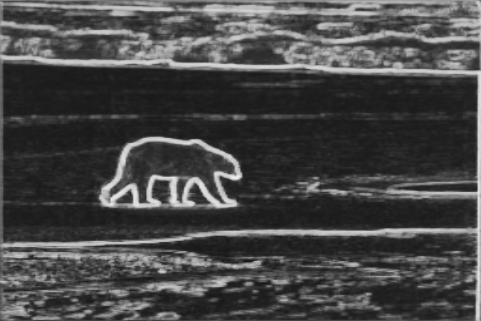
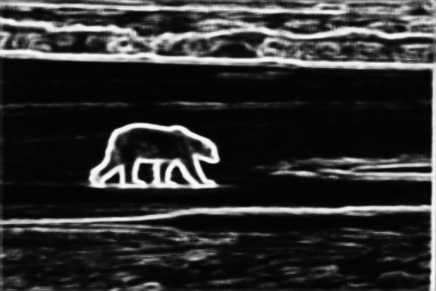
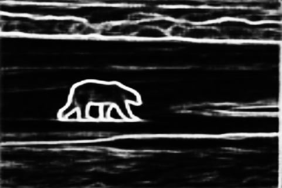
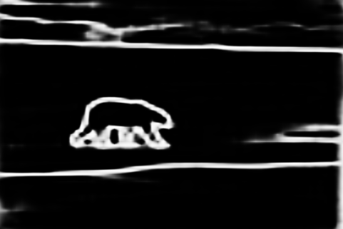
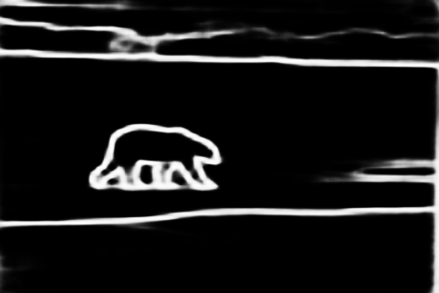
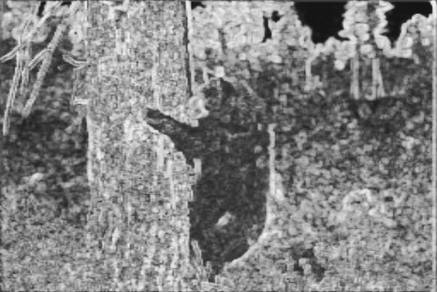
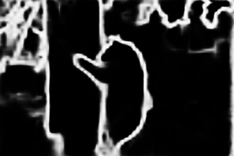
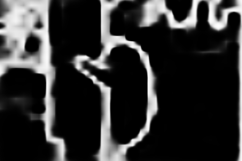
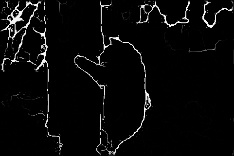

# rcf

variety of Richer Convolutional Features for Edge Detection (resnet101-based)

## motivation
原论文已经有一个[pytorch实现](https://github.com/meteorshowers/RCF-pytorch)，再次重复造轮子没有必要。

所以作为课程作业，同时想了解下edge-detection是怎么做的，所以试着照原论文的思想，将backbone换成resnet101，结构稍微做一些改变，测试一下效果。

许多处参照了[pytorch实现](https://github.com/meteorshowers/RCF-pytorch)， 如训练策略，网络实现，（data_loader直接拿来用了）。

## results

ODS: **0.796** , OIS: **0.814**  on BSDS500 dataset

## requirements

* pytorch 0.4.1
* python 3.6.6
* dataset(provide by [original rcf repo](https://github.com/yun-liu/rcf))
    * http://mftp.mmcheng.net/liuyun/rcf/data/bsds_pascal_train_pair.lst
    * http://mftp.mmcheng.net/liuyun/rcf/data/HED-BSDS.tar.gz
    * http://mftp.mmcheng.net/liuyun/rcf/data/PASCAL.tar.gz
* and other requiremnts... (cv2, numpy , etc.)

## usage

#### train:

* put your data in 'data/HED-BSDS_PASCAL' (or make a soft link)
* python train.py

#### simple example:
* python example.py

#### evaluate:

it may take several hours...

* pretrained model will be available soon....

* requirements:
  * matlab
  * hed [link](https://github.com/xwjabc/hed/tree/c8ed5abc4d2b6ad2862b0d61cf6184ce2cdf3cae)

* you should modify [path to your predicts](https://github.com/mayorx/rcf/blob/master/eval_edge.m#L3) and [path to ground truth (.mat)](https://github.com/mayorx/rcf/blob/master/eval_edge.m#L39)
* sh eval.sh

  

