# rcf
Richer Convolutional Features for Edge Detection **变体**

## motivation
原论文已经有一个[pytorch实现](https://github.com/meteorshowers/RCF-pytorch)，再次重复造轮子没有必要。

所以作为课程作业，同时想了解下edge-detection是怎么做的，所以试着照原论文的思想，将backbone换成resnet101，结构稍微做一些改变，测试一下效果。

许多处参照了[pytorch实现](https://github.com/meteorshowers/RCF-pytorch)， 如训练策略，网络实现，（data_loader直接拿来用了）。

## results
现在模型才训练了 2%  （10000/490000）， 以下是一些临时结果。
依次是layer1 ~ layer5的结果，综合结果， groundtruth，original image共8个图

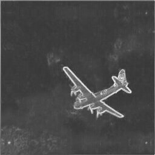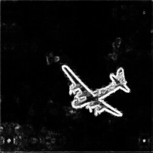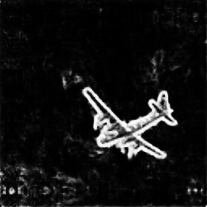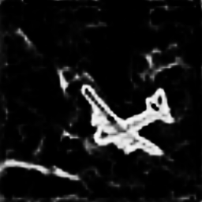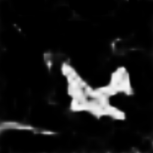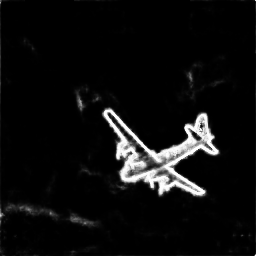

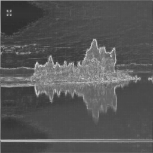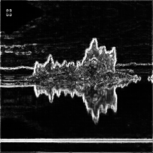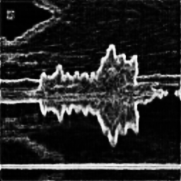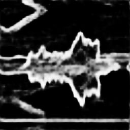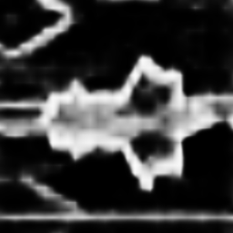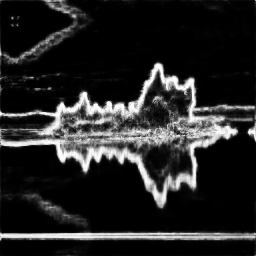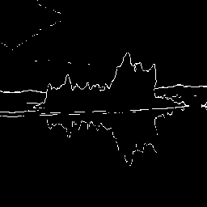

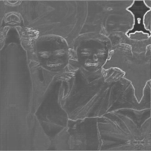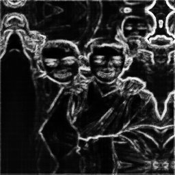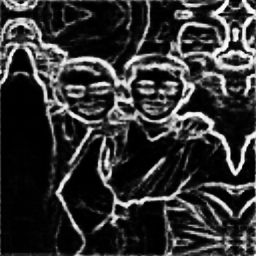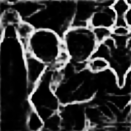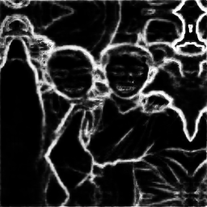
